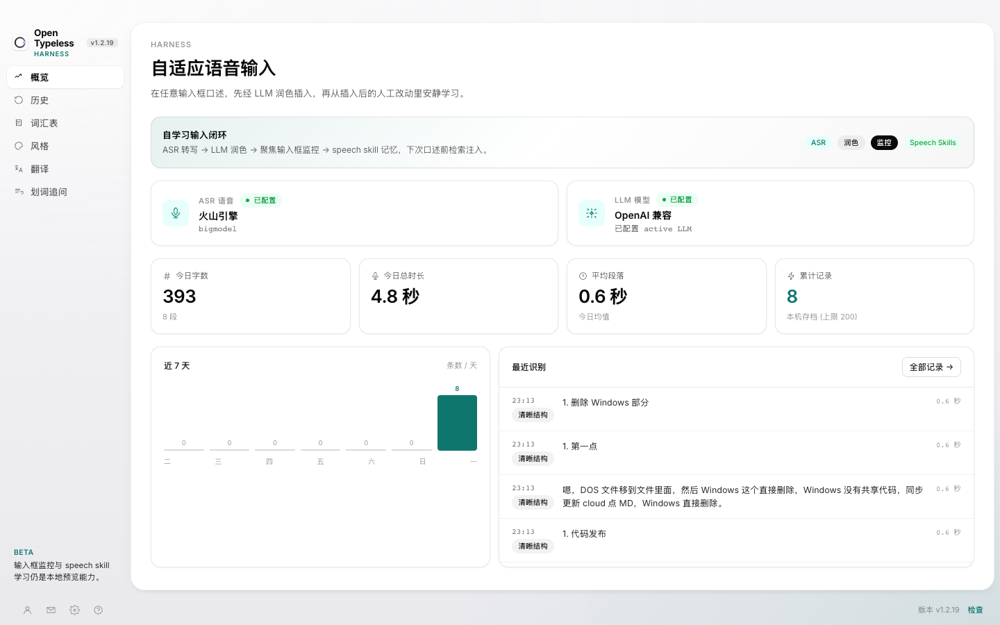

# Open Typeless Harness

  <strong>Voice input that learns from the corrections you actually make.</strong>

  • Speak • Polish • Insert • Learn Locally •

  <a href="README.zh.md">中文</a> •
  <a href="#why-it-exists">Why</a> •
  <a href="#how-it-learns-your-habits">Learning</a> •
  <a href="#status">Status</a>

  
  
  
  

  

## Why It Exists

Plain speech-to-text keeps making the same mistakes: product names, project names, mixed Chinese/English terms, and the phrases you always fix right after insertion.

Open Typeless Harness treats those edits as signal. It transcribes, polishes, inserts into the focused field, then learns from your post-insertion corrections so future dictation better matches your vocabulary.

> Every correction after the text lands should make the next insertion better.

## What It Should Remember

| You say or receive | You correct to |
| --- | --- |
| `type script` | `TypeScript` |
| `知呼` | `知乎` |
| `cold 或者 cold` | `Claude Code 或 Codex` |

The goal is not just prettier transcription. The goal is a voice input layer that adapts to the words you actually use.

## How It Learns Your Habits

1. You dictate into the app you are already using.
2. The app inserts polished text into the focused field.
3. For a short window after insertion, the edit monitor watches how that text changes.
4. If the same correction pattern appears repeatedly, it becomes a local speech skill.
5. On later dictation, matching speech skills are retrieved before polishing, so the model sees your vocabulary before it writes.

This is why the learning loop is based on edits after insertion, not just ASR confidence. Your actual correction is the strongest preference signal.

## Local By Default

Correction evidence and speech skills stay on the machine by default. The app is an input layer, not an autonomous agent: it writes into the field you are already using instead of taking actions for you.

## Status

Open Typeless Harness is a technical preview built as an experimental OpenClaudex fork/fusion on top of the OpenLess desktop runtime.

The current focus is focused-field dictation, LLM-polished insertion, post-insertion edit monitoring, and local speech-skill learning.

## Acknowledgements

Built on top of the OpenLess desktop runtime and released under inherited MIT license terms.

## License

[MIT](LICENSE)
