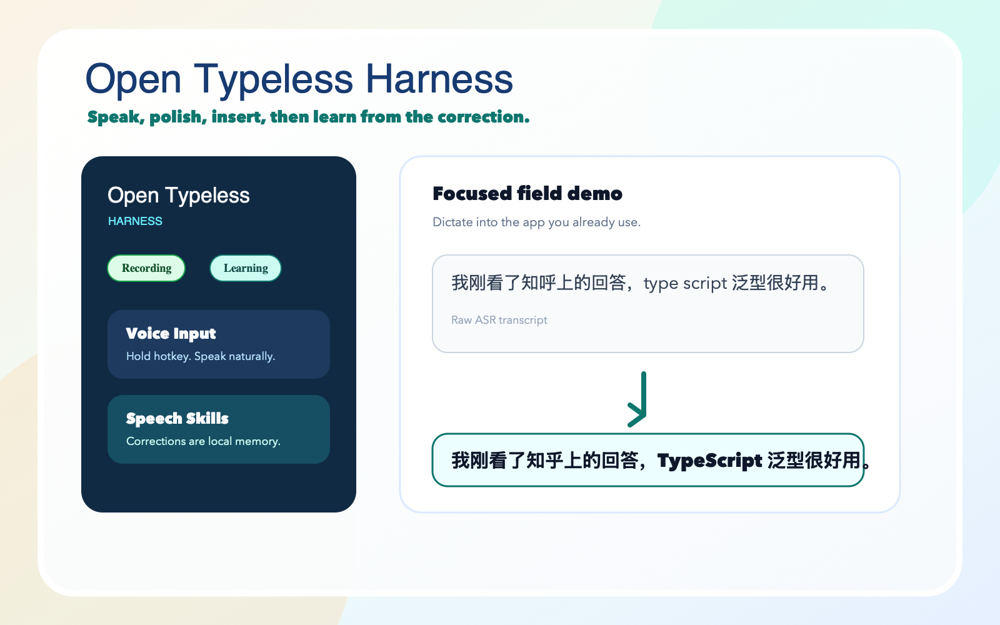
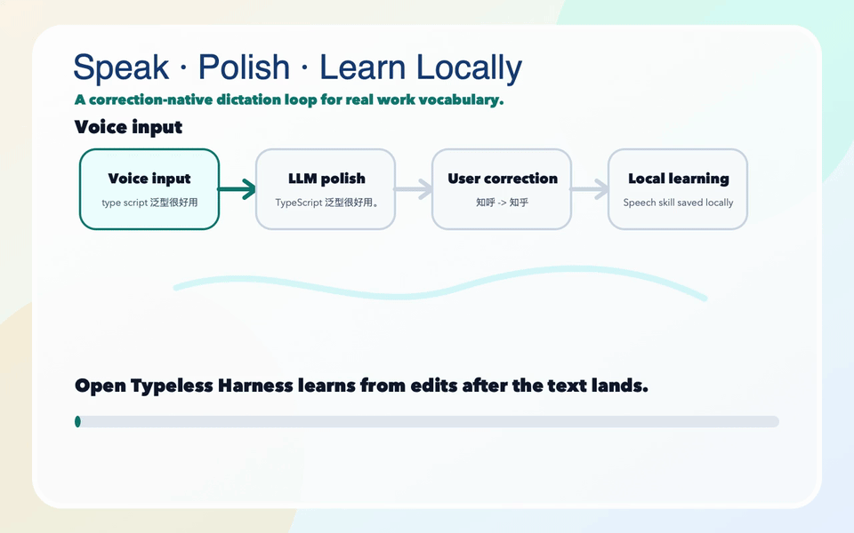
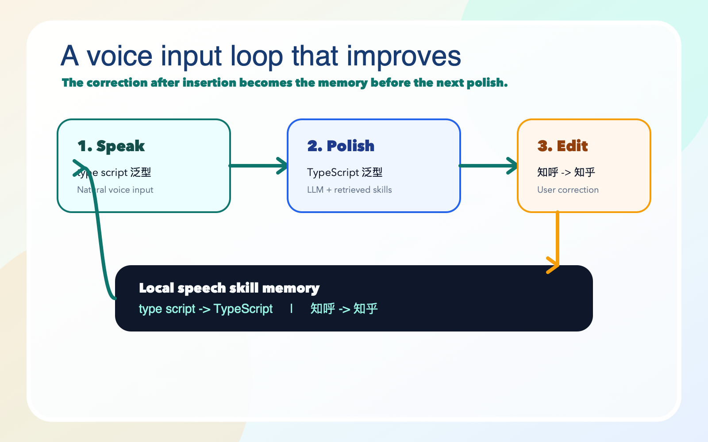

# Open Typeless Harness

<p align="center">
  
</p>

<p align="center">
  <strong>Voice input that remembers how you correct it.</strong>
</p>

<p align="center">
  • Speak • Polish • Learn Locally •
</p>

<p align="center">
  <a href="README.zh.md">中文文档</a> •
  <a href="#why">Why</a> •
  <a href="#product-preview">Product Preview</a> •
  <a href="#how-it-works">How It Works</a>
</p>

<p align="center">
  
  
  
  
</p>

## Why

Speech-to-text is not enough.

Real voice input fails on the same things again and again: product names, project names, mixed Chinese/English terms, personal phrasing, and the small corrections you make right after the text lands in the input box.

Open Typeless Harness is built around one idea:

> **Every post-insertion edit is a learning signal.**

You speak naturally. The app transcribes and polishes the text, inserts it into the focused field, then watches how you correct it. Stable correction patterns become local speech skills and are retrieved before later polishing.

The result is a voice input layer that should become more aligned with your vocabulary the more you use it.

## Product Preview

<p align="center">
  
</p>

<p align="center">
  
</p>

<p align="center">
  <a href="docs/assets/open-typeless-harness-demo.mp4">Download MP4 demo</a>
</p>

## What It Solves

- You say `type script`; it should know you mean `TypeScript`.
- You correct `知呼` to `知乎`; it should remember that.
- You repeat a product name; it should stop treating it as a one-off ASR mistake.
- You dictate into any focused field; it should fit into the app you are already using.

## How It Works

<p align="center">
  
</p>

```text
Voice input
  -> ASR transcript
  -> LLM polish with retrieved speech skills
  -> Insert into focused text field
  -> Observe post-insertion edits
  -> Learn local speech skills
```

Example:

```text
Inserted: 我想对表说 cold 或者 cold
Edited:   我想对标说 Claude Code 或 Codex
Learned:  cold 或者 cold -> Claude Code 或 Codex
```

## Principles

- **Input layer, not an autonomous agent.** It helps you write into the current field; it should not execute tasks by itself.
- **Learning from real edits.** The best signal is what the user actually fixes after insertion.
- **Local by default.** Correction evidence and speech skills are local unless explicitly exported or synced.
- **Context over global replacement.** Ambiguous corrections should become contextual skills, not unsafe global find-and-replace rules.

## Status

Open Typeless Harness is a technical preview built as an experimental OpenClaudex fork/fusion on top of the OpenLess desktop runtime.

Current focus:

- focused-field dictation
- LLM-polished insertion
- post-insertion edit monitoring
- local speech-skill learning
- safer contextual correction memory

## Acknowledgements

Built on top of the OpenLess desktop runtime and released under inherited MIT license terms.

## License

[MIT](LICENSE)
